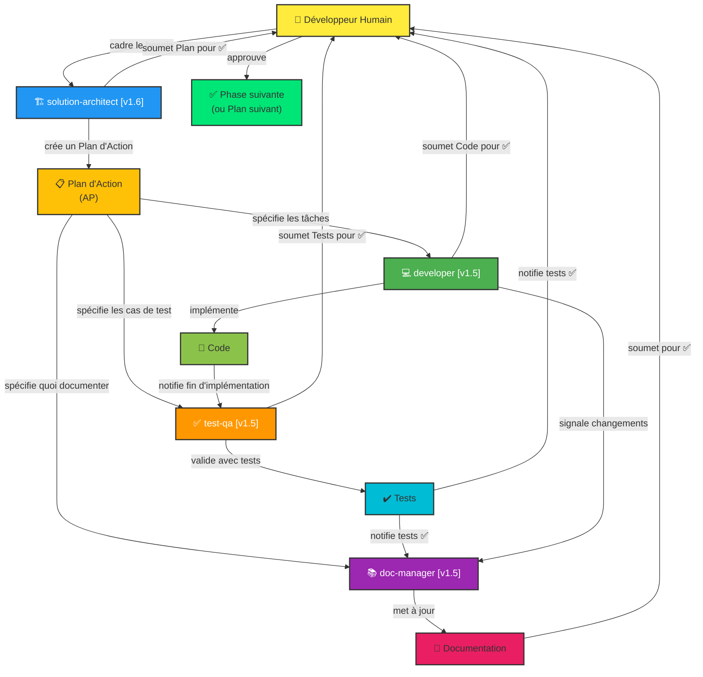

# Instructions Copilot pour domoticz-mobile

## 👋 Bienvenue ! Agents Copilot et Relations

Le projet **domoticz-mobile** utilise une **architecture multi-agents** orchestrée pour coordonner le développement, les tests et la documentation via des **Plans d'Action (AP)** structurés.

### 🤖 Les Agents et leurs Rôles

Quatre agents spécialisés travaillent ensemble, orchestrés par un **développeur humain** :

#### **solution-architect** [v1.6]
- **Rôle :** Planificateur et orchestrateur technique
- **Responsabilités :**
  - Concevoir des solutions architecturales complètes
  - Créer et valider les Plans d'Action multi-phases
  - Décomposer les initiatives en tâches logiques
  - Orchestrer le travail entre developer, test-qa et doc-manager
- **Quand l'utiliser :** "Conçois une architecture pour...", "Crée un plan pour...", "Découpe ça en tâches"
- **Livrable :** Plans d'Action détaillés avec phases, tâches et dépendances

#### **developer** [v1.5]
- **Rôle :** Implémentateur de code de production
- **Responsabilités :**
  - Traduire les exigences en code fonctionnel et testé
  - Respecter les patterns architecturaux et conventions du projet
  - Mettre à jour les dépendances et refactoriser le code
  - Implémenter les optimisations de performance
- **Quand l'utiliser :** "Implémente cette fonctionnalité", "Développe selon l'architecture", "Code cette fonction"
- **Livrable :** Code propre, compilant et compilant sans erreurs

#### **test-qa** [v1.5]
- **Rôle :** Expert en assurance qualité et tests
- **Responsabilités :**
  - Écrire des tests unitaires complets (composants React, services)
  - Assurer une couverture de test ≥80%
  - Tester les cas limites et les scénarios d'erreur
  - Valider que le code fonctionne correctement
- **Quand l'utiliser :** "Écris des tests pour ce composant", "Génère des tests unitaires", "Valide avec des tests"
- **Livrable :** Tests passants avec rapports de couverture

#### **doc-manager** [v1.5]
- **Rôle :** Gardien de la documentation
- **Responsabilités :**
  - Mettre à jour README, Wiki et guides
  - Documenter les changements architecturaux
  - Mettre à jour les instructions Copilot quand les agents changent
  - Garder la documentation en sync avec le code
- **Quand l'utiliser :** "Mets à jour la documentation", "Garde les docs en sync avec ce code", "Ajoute ça au README"
- **Livrable :** Documentation à jour, claire et complète

---

### 📊 Relations entre Agents (Diagramme Mermaid)



---

### 🔄 Workflow Typique

1. **Cadrage (Développeur Humain)** → Définir le besoin et les critères d'acceptation
2. **Planification (solution-architect)** → Créer un Plan d'Action avec phases et tâches
3. **Validation Humaine** → Approuver le plan avant de lancer
4. **Implémentation (developer)** → Coder les tâches assignées
5. **Validation Humaine** → Approuver le code avant tests
6. **Tests (test-qa)** → Écrire et valider les tests
7. **Validation Humaine** → Approuver les tests avant doc
8. **Documentation (doc-manager)** → Mettre à jour la documentation
9. **Validation Humaine** → Approuver la documentation
10. **Phase Suivante** → Lancer la phase suivante du plan (étape 2)

---

### 📋 Plans d'Action et Suivi

Chaque initiative majeure (modernisation, nouvelle feature, refactoring) est orchestrée via un **Plan d'Action (AP)** :

- **Fichier plan :** `.github/plans/<NO>_<nom>.plan.md`
- **Rapports de phase :** `.github/plans/<NO>_reports/PHASE_N_...md`
- **Index des plans :** `.github/plans/README.md`
- **Guide complet :** `.github/PLANS.md`

Les Plans d'Action coordonnent le travail multi-phases et garantissent une traçabilité complète via les rapports.

---

## Présentation du projet


Application mobile React Native / Expo pour piloter des équipements domotiques via un serveur [Domoticz](https://www.domoticz.com/). Cible principalement Android et le web. L'interface utilisateur est en français.

## Commandes

```bash
npm start               # Démarrer le serveur de développement Expo
npm run android         # Lancer sur émulateur/appareil Android
npm run web             # Lancer sur le web
npm test                # Lancer Jest en mode watch
npm test -- path/to/file.test.tsx          # Lancer un fichier de test précis
npm test -- --testNamePattern="test name"  # Lancer les tests correspondant à un nom
npm run lint            # ESLint via Expo
```

Builds EAS (distribution APK Android) :
```bash
eas build --profile development
eas build --profile preview      # APK à distribution interne
eas build --profile production
```

## Architecture

```
app/
  _layout.tsx             # Layout racine : ThemeProvider (dark) + DomoticzContextProvider + Stack
  (tabs)/
    _layout.tsx           # Barre d'onglets personnalisée (5 onglets : Favoris, Lumières, Volets, Températures, Maison) + header unifié
    index.tsx             # Favoris (mode actions rapides)
    devices.tabs.tsx      # Lumières / Volets
    temperatures.tab.tsx  # Capteurs de température + thermostats
    parametrages.tab.tsx  # Maison (pilotage global + section À propos)
  components/             # Composants de niveau écran (device, temperature, thermostat, paramètres, favoris, groupes)
  controllers/            # Fonctions de chargement des données ; pont entre l'UI et les services
  services/               # ClientHTTP.service.ts (client HTTP), DataUtils.service.ts (tri, groupes, AsyncStorage favoris), fournisseur de contexte
  models/                 # Modèles TypeScript sous forme de classes (DomoticzDevice, DomoticzConfig, …)
  enums/                  # Constantes et enums (Colors, DomoticzEnum, APIconstants, TabsEnums)

components/               # Composants UI génériques partagés (ThemedText, ParallaxScrollView, icônes)
hooks/                    # Hooks React personnalisés (useColorScheme, useThemeColor, AndroidToast)
assets/                   # Polices, icônes, images
```

**Routing :** Expo Router avec routage basé sur les fichiers. Routes typées activées (`experiments.typedRoutes: true`).

**Gestion d'état :** React Context API via `DomoticzContextProvider` (global : état de la connexion, appareils, températures, thermostats, paramètres). `useState` local pour l'état purement UI.

**Flux de données :**
```
Onglet UI → fonction controller → callDomoticz() (HTTP GET) → serveur Domoticz
                                          ↓
                            Mise à jour du Context → re-rendu UI
```

## API / Backend

Toutes les requêtes passent par `app/services/ClientHTTP.service.ts` :
- `callDomoticz(SERVICES_URL, params?)` — fonction fetch unique avec Basic Auth
- URL de base depuis `EXPO_PUBLIC_DOMOTICZ_URL` ; authentification depuis `EXPO_PUBLIC_DOMOTICZ_AUTH` (Base64)
- Modèle d'URL : `{BASE_URL}/json.htm?type=command&param=...`
- Remplacement de paramètres dans les URLs : `<IDX>`, `<CMD>`, `<LEVEL>`, `<TEMP>`
- Réponses validées sur le champ `status: "OK"` / `"ERR"` du JSON Domoticz
- Les requêtes sont tracées avec un UUID (`traceId`) loggué en console

Les variables d'environnement doivent être préfixées `EXPO_PUBLIC_` pour être accessibles dans le bundle client.

## Conventions clés

### Nommage des fichiers
- Composants de niveau écran : `*.component.tsx` (dans `app/components/`)
- Services : `*.service.ts`
- Controllers : `*.controller.tsx`
- Modèles : `*.model.ts`
- Tests : `*-test.tsx` ou `*.test.tsx` (dans `__tests__/`)

### TypeScript
- Mode strict activé.
- **Modèles sous forme de classes** — utiliser des classes (pas de simples interfaces) pour les modèles de données Domoticz.
- `readonly` pour les propriétés de modèle qui ne doivent pas changer après la construction.
- Props typées sous la forme `export type XxxProps = { ... }`, composants typés `React.FC<XxxProps>`.

### Composants
- Composants fonctionnels avec hooks uniquement (pas de composants classe).
- Accès à l'état global via `useContext(DomoticzContext)` — éviter le prop drilling.
- Styles via `StyleSheet.create()` défini en bas du fichier.
- Thème sombre uniquement (`userInterfaceStyle: "dark"` dans app.json).
- **Labels métier pour les états des appareils** : utiliser "Allumé"/"Éteint" (lumières), "Ouvert"/"Fermé" (volets), "Déconnecté" (inactif), "Mixte" (groupe à niveaux incohérents) — jamais "On"/"Off" ou "-" dans l'UI.
- **Chips/boutons segmentés** pour les paramètres interactifs (présence, phase) — ne pas utiliser de `Dropdown`.
- **Volets** : les volets utilisent le slider + `onClickDeviceIcon` dans `IconDomoticzDevice.tsx` — ne pas remplacer ce mécanisme par une barre de boutons dédiée.

### Conventions UX/UI (phase 2)
- **Onglets** : conserver les 5 libellés FR existants (`Favoris`, `Lumières`, `Volets`, `Températures`, `Maison`) et leurs icônes associées.
- **Header unifié** : tous les onglets passent par `AppHeader` via `ParallaxScrollView` avec triplet fixe **icône + titre + badge de connexion**.
- **Statut de connexion** : utiliser exclusivement les états canoniques du badge (`Connecté`, `Synchronisation`, `Déconnecté`, `Erreur`) via `ConnectionBadge`.
- **Favoris** : l'écran `index.tsx` est en mode **actions rapides** (`FavoriteCard`) ; slider conditionnel disponible en mode `previewC` ; maximum **8** favoris actifs affichés.
- **Thermostats** : garder la distinction explicite **Mesure / Consigne** dans l'UI.
- **Terminologie FR** : conserver les termes "Maison", "Mesure", "Consigne", "Favoris", "Déconnecté" (pas de variantes anglaises).

### Controllers
- Reçoivent un callback setter (depuis le Context) plutôt que d'appeler setState directement.
- Utilisent des chaînes de promesses (`.then().catch()`) — pas d'async/await.
- Afficher `AndroidToast` en cas d'erreur plutôt qu'une UI d'erreur inline.

### Enums & constantes
- Les types d'appareils, types de switches, commandes et endpoints API sont définis sous forme d'enums TypeScript dans `app/enums/`.
- Couleurs centralisées dans `app/enums/Colors.ts`.

## Tests

- Framework : Jest avec le preset `jest-expo`.
- Les tests existants utilisent le snapshot testing via `react-test-renderer`.
- Pas de tests d'intégration ou E2E pour l'instant.

---

## 📋 Plans d'Action, Tâches et Suivi

### Vue d'ensemble

Les **plans d'action** (AP pour "Action Plan") orchestrent le travail multi-phases coordonné entre plusieurs agents. Chaque plan :
- Décrit un **objectif global** (ex: modernisation complète, nouvelle fonctionnalité, refactoring)
- Se décompose en **phases** logiques et **tâches** détaillées
- Assigne les tâches à des **agents spécifiques** (developer, test-qa, solution-architect, doc-manager)
- Définit les **critères de réussite** et les dépendances entre phases

### Structure des répertoires

```
.github/plans/
├── <no_du_plan>_<nom_du_plan>.plan.md       # Fichier plan principal
├── <no_du_plan>_reports/                    # Répertoire de reporting
│   ├── PHASE_1_COMPLETION_REPORT.md
│   ├── PHASE_2_COMPLETION.md
│   └── ...
└── <autre_plan>/
```

**Convention :** 
- Fichier plan : `.github/plans/001_modernisation_complète.plan.md`
- Dossier reporting : `.github/plans/001_reports/`

### Contenu du fichier plan

Chaque fichier `*.plan.md` doit contenir :

1. **En-tête** : Métadonnées (document, date de création, statut)
2. **🎯 Objectif Global** : Quel problème résoudre et pourquoi
3. **Phases** : Chaque phase doit inclure :
   - **Contexte** : Situation actuelle, problèmes identifiés
   - **Critères de Réussite** : Conditions d'acceptation claires (✅)
   - **Tâches** : Liste détaillée avec :
     - **Numéro** (T<PHASE>.<NUM>)
     - **Titre & Description**
     - **Fichiers touchés**
     - **Que couvrir / implémenter**
     - **Critères d'acceptation** (testable, mesurable)
   - **Agent responsable** : Qui exécute cette phase
4. **Résumé des Tâches par Agent** : Recap des livraables par agent
5. **Dépendances entre Phases** : Diagramme de dépendances
6. **Critères de Succès Globaux** : Mesures finales
7. **Plan d'Exécution** : Ordre de démarrage des phases et agents

### Exemple de tâche bien formée

```markdown
#### T1.1 - Écrire tests ClientHTTP.service
- **Fichier :** `app/services/__tests__/ClientHTTP.service.test.ts`
- **Couvrir :**
  - `callDomoticz()` — succès, erreur réseau, SSL
  - Gestion du `traceId` UUID
  - Parsing de réponse (OK / ERR)
- **Acceptation :** ≥90% couverture du service
```

**Checklist pour une bonne tâche :**
- ✅ Numéro unique et hiérarchique (T<PHASE>.<NUM>)
- ✅ Titre clair et verbe action (Écrire, Refactoriser, Auditer, etc.)
- ✅ Fichier(s) précis touchés
- ✅ Scope explicite (quoi couvrir, quoi implémenter)
- ✅ Acceptation testable et mesurable (pas "faire mieux", mais "≥90% couverture")
- ✅ 2-3 phrases max, pas de détails d'implémentation

### Reportings et suivi

#### Structure du reporting

Pour chaque plan d'action, créer un dossier `.github/plans/<no>_reports/` contenant un rapport **par phase** :

```
.github/plans/001_reports/
├── PHASE_1_COMPLETION_REPORT.md      # Couvrir les tests (T1.1-T1.7)
├── PHASE_2_COMPLETION_REPORT.md      # Dépendances (T2.1-T2.8)
├── PHASE_3_COMPLETION_REPORT.md      # Architecture (T3.1-T3.5)
└── PHASE_6_FINAL_REVIEW.md           # Documentation + synthèse
```

#### Format d'un rapport de phase

```markdown
# Phase N : <Titre de la Phase>

**Responsable Agent :** [developer | test-qa | solution-architect | doc-manager]  
**Date Début :** YYYY-MM-DD  
**Date Fin :** YYYY-MM-DD  
**Statut :** ✅ COMPLÉTÉE | 🔄 EN_COURS | ❌ BLOQUÉE

## Tâches

### T<N>.<M> - <Titre Tâche>
- **Statut :** ✅ DONE | 🔄 IN_PROGRESS | ⏳ PENDING | ❌ BLOCKED
- **Fichiers Modifiés :**
  - `path/to/file1.ts` — Changements apportés
  - `path/to/file2.tsx` — Changements apportés
- **Résultats :**
  - Coverage : 92% (≥90% ✅)
  - Exemples de changements majeurs
- **Notes :** Tout commentaire pertinent, problèmes rencontrés, décisions prises

## Synthèse

- **Tâches Complétées :** 7/7
- **Critères de Réussite Atteints :** 5/5 ✅
- **Bloqueurs :** Aucun
- **Améliorations Futures :** [Optional] Idées pour améliorer après livraison

## Livrables

- ✅ Tous les tests unitaires écris et passant
- ✅ Couverture globale ≥80%
- ✅ Rapport de couverture dans `coverage/`

---

**Fin du rapport Phase N**
```

### Suivi des tâches (SQL ou Markdown)

Le suivi peut se faire via :

1. **SQL (pour requêtes dynamiques) :**
   ```sql
   INSERT INTO todos (id, title, description, status) VALUES
     ('phase1-test-http', 'Tester ClientHTTP.service', 'T1.1 — Couvrir callDomoticz(), traceId, erreurs', 'in_progress');
   ```

2. **Issue GitHub** (link vers le plan) :
   - Title : `[AP-001] Modernisation Phase 1 : Tests`
   - Body : Reference vers `.github/plans/001_modernisation_complète.plan.md`
   - Milestones : `Phase 1 Tests`

3. **Markdown (dans le rapport)** :
   - Checklist dans le rapport de phase
   - Une ligne par tâche avec statut ✅/🔄/❌

### Workflow recommandé

1. **Créer le plan** (utilisateur + solution-architect si besoin)
   - Écrire `.github/plans/<no>_<nom>.plan.md`
   - Définir phases, tâches, agents, dépendances
   - Valider avec l'équipe (si applicable)

2. **Démarrer une phase** (agent responsable)
   - Créer le rapport vide `.github/plans/<no>_reports/PHASE_N_REPORT.md`
   - Commencer les tâches assignées
   - Documenter en temps réel (statut ✅/🔄)

3. **Compléter le reporting** (après phase)
   - Remplir le rapport avec résultats, fichiers modifiés, notes
   - Lister les critères de réussite atteints
   - Signaler tout bloqueur ou problème pour les phases suivantes

4. **Valider et archiver** (utilisateur / lead)
   - Confirmer que la phase remplit les critères de réussite
   - Approuver ou demander des ajustements
   - Passer à la phase suivante

### Intégration avec les agents

Chaque agent (developer, test-qa, solution-architect, doc-manager) doit :

1. **Lire le plan complet** au démarrage
2. **Identifier ses tâches** (T<N>.X assignées à son rôle)
3. **Exécuter et documenter** en parallèle (notamment dans ses résultats)
4. **Créer ou remplir le rapport** de sa phase

**Exemple :** Si test-qa est lancé pour Phase 1 :
```
Prompt: "Exécute la Phase 1 du plan .github/plans/001_modernisation_complète.plan.md
Tâches à faire : T1.1 à T1.7 (Tests unitaires)
Rapport à remplir : .github/plans/001_reports/PHASE_1_COMPLETION_REPORT.md"
```

### Bonnes pratiques

✅ **DO :**
- Garder les plans concis mais détaillés (500-1000 lignes)
- Numéroter les tâches de façon hiérarchique (T<PHASE>.<TASK_NUM>)
- Définir des critères mesurables ("≥80%" vs "bien testé")
- Lister les dépendances explicites entre phases
- Documenter les décisions prises dans les rapports

❌ **DON'T :**
- Créer des tâches trop larges ("refactoriser tout le code")
- Omettre les critères d'acceptation
- Laisser les rapports vides ou superficiels
- Ajouter de nouvelles tâches en cours d'exécution sans modifier le plan
- Mélanger les responsabilités (agent X ne doit pas faire les tâches de Y)

### Archivage

Une fois qu'un plan est terminé :
- ✅ Garder le fichier plan `.plan.md` (référence historique)
- ✅ Garder les rapports dans `<no>_reports/`
- 📌 Créer un lien dans le README ou CHANGELOG vers le plan complété

---
